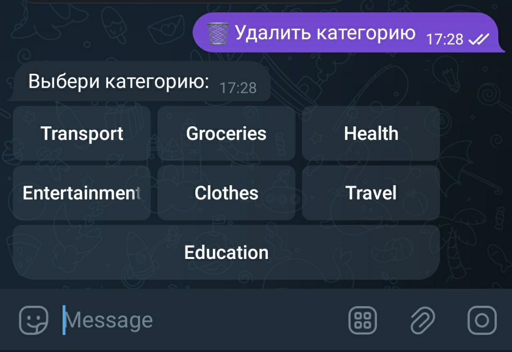
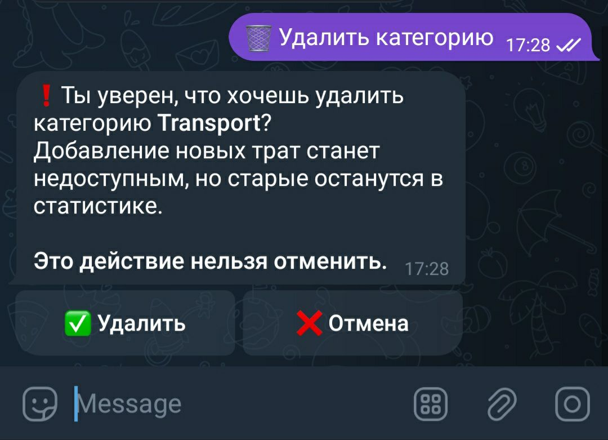
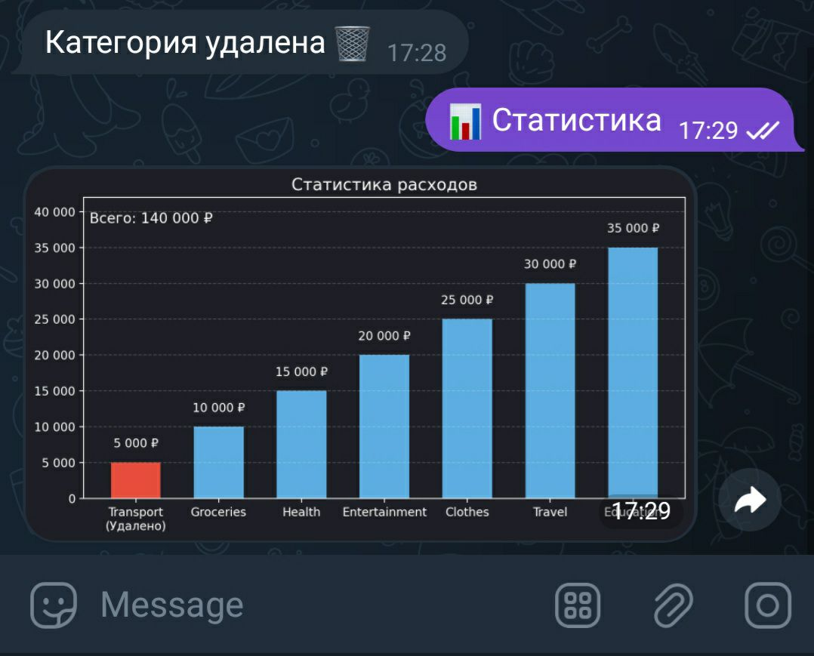

# 💰 Telegram Bot – Financial Assistant

Личный ассистент в Telegram для учёта расходов.  
Бот помогает фиксировать траты по категориям, анализировать статистику и визуализировать расходы в диаграммах.

Ссылка на бота: [Financial assistant](https://t.me/FinanceAssit_bot)

## Возможности

- 📌 Создание, переименование и удаление категорий
- ✍️ Запись расходов с указанием суммы и категории
- 📊 Просмотр статистики всех трат за последнюю неделю или месяц
- 📉 Просмотр 3-х основных категорий и остального за последнюю неделю или месяц

---

## 🖼️ Пример работы

### Старт


### Запись расходов


### Статистика


### Основные траты


### Удаление категорий




### 🚀 Как запустить

1. Клонируй проект:
``` git clone https://github.com/GoodMan887/TG-bot-Financial-Assistent ```
2. Установи зависимости: ```pip install -r requirements.txt```
3. Создай .env файл и добавь в него свой Telegram токен : `BOT_TOKEN=your_token_here`
4. Запусти бота: ```python main.py```
