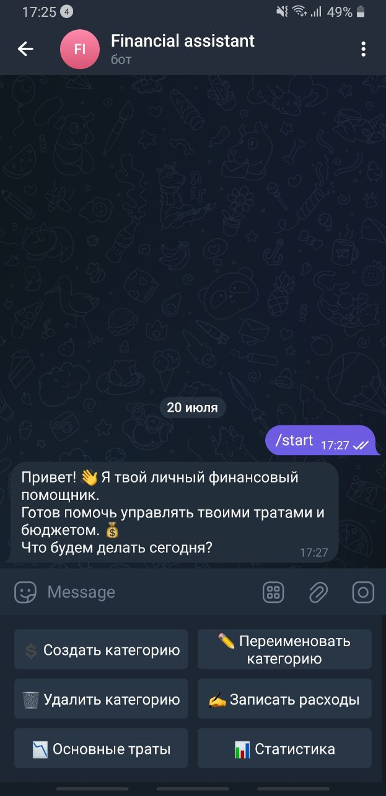
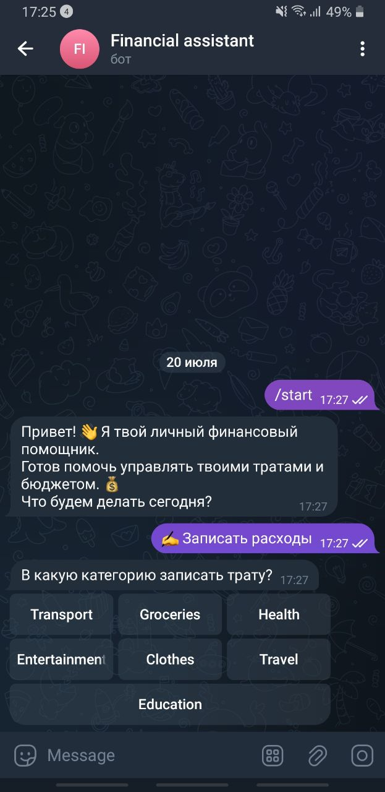
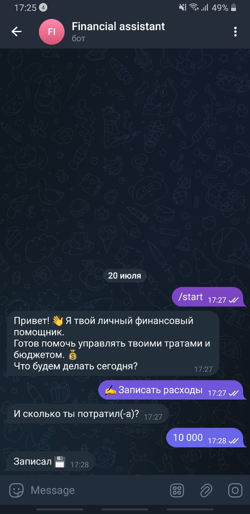
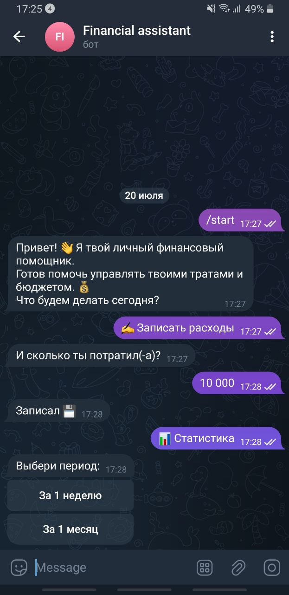
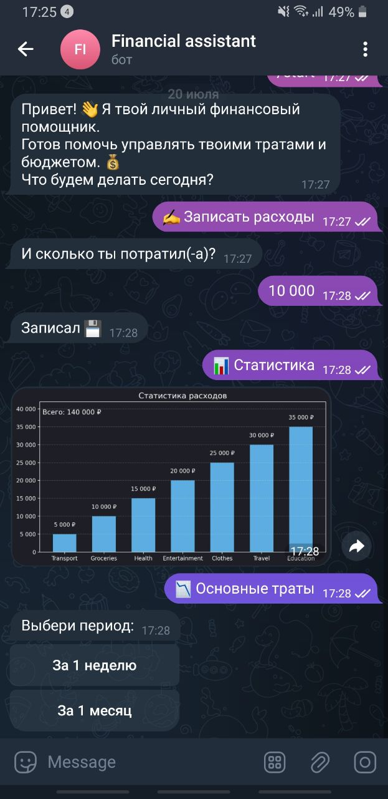
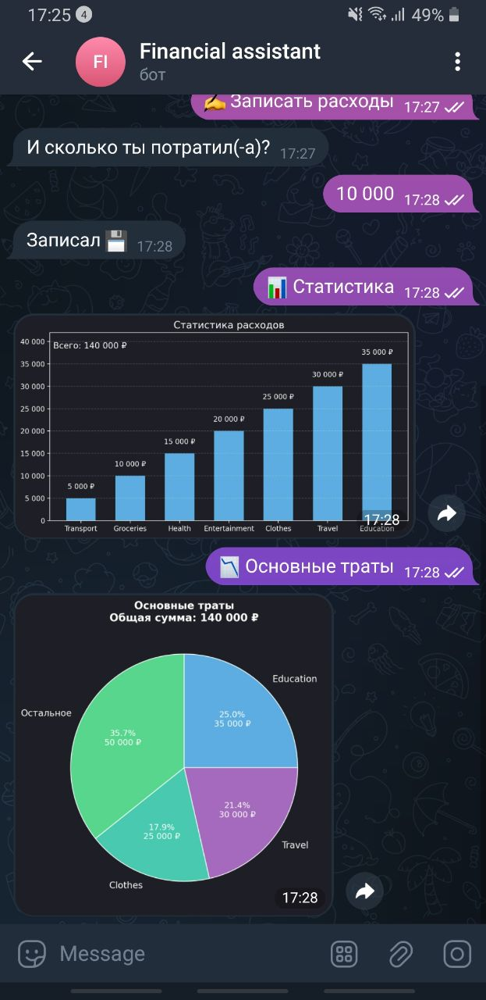
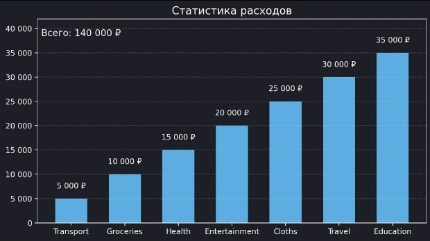
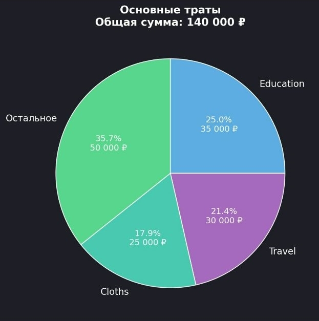

# 💰 Telegram Bot – Financial Assistant

Личный ассистент в Telegram для учёта расходов.  
Бот помогает фиксировать траты по категориям, анализировать статистику и визуализировать расходы в диаграммах.

Ссылка на бота: [Financial assistant](https://t.me/FinanceAssit_bot)

## Возможности

- 📌 Создание, переименование и удаление категорий
- ✍️ Запись расходов с указанием суммы и категории
- 📊 Просмотр статистики за последнюю неделю или месяц
- 📈 Отображение диаграмм:
  - Столбчатая диаграмма всех трат
  - Круговая диаграмма трёх основных категорий и остального

---
## 🖼️ Пример работы

### Старт


### Запись расходов



### Статистика



### Основные траты



### Диаграммы

#### Столбчатая диаграмма (общая статистика)


#### Круговая диаграмма (основные траты)


### 🚀 Как запустить

1. Клонируй проект:
```bash git clone https://github.com/твой-профиль/your-bot.git ```
2. Установи зависимости: pip install -r requirements.txt
3. Создай .env файл и добавь в него свой Telegram токен : BOT_TOKEN=your_token_here
4. Запусти бота: python main.py
